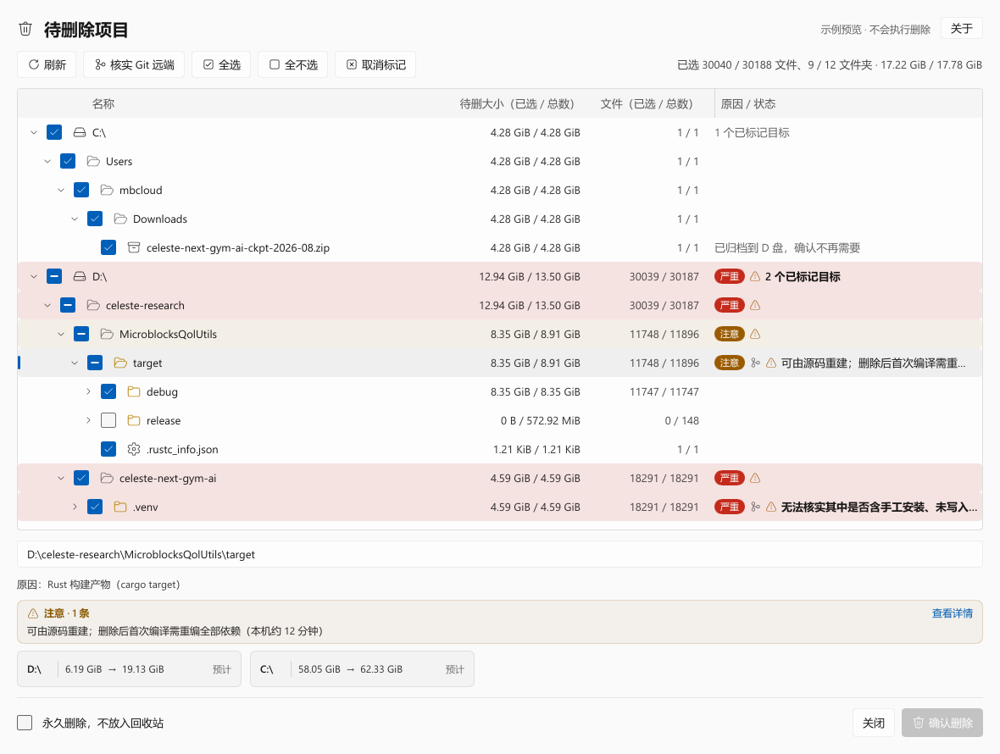
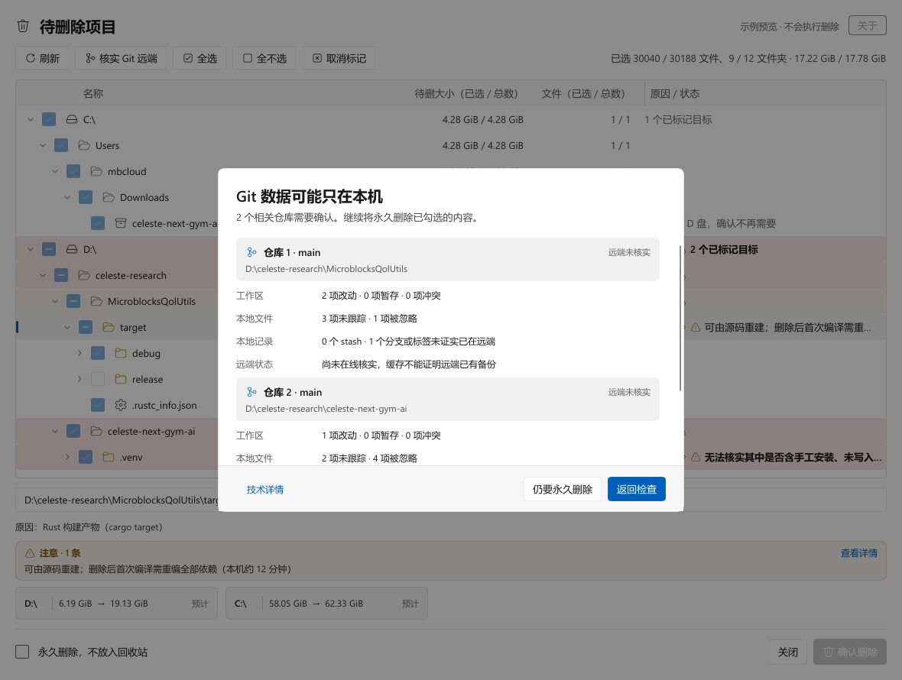
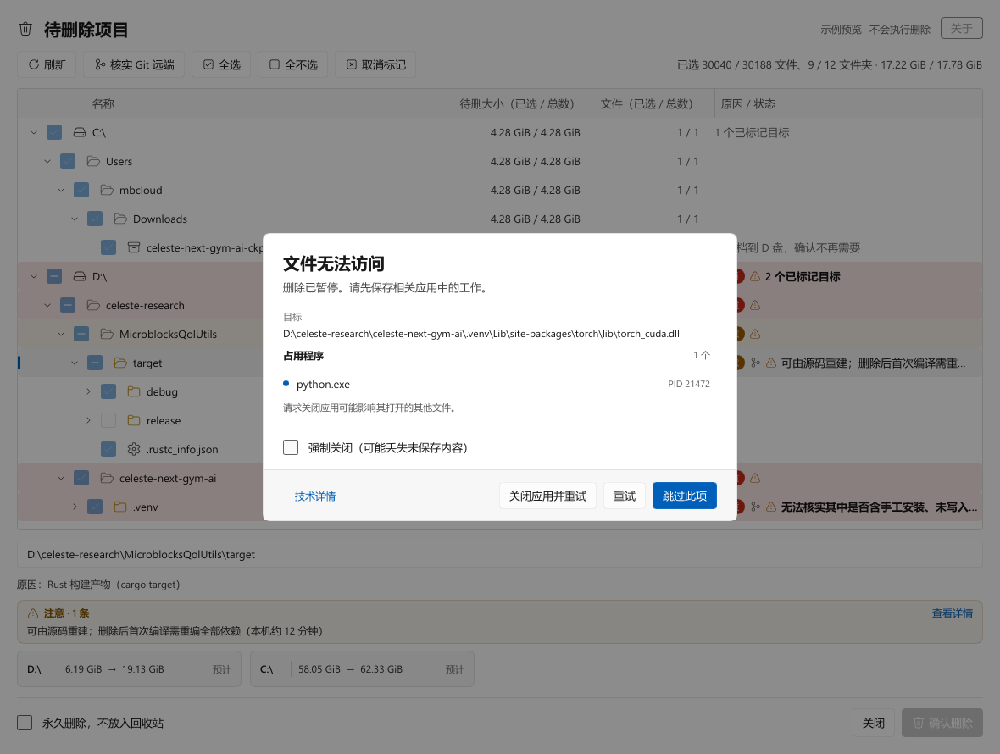
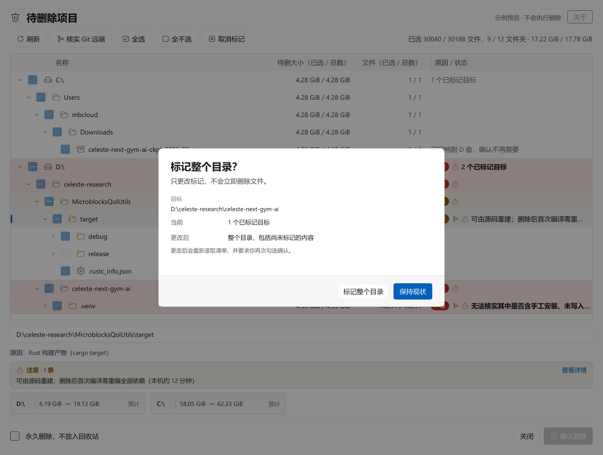
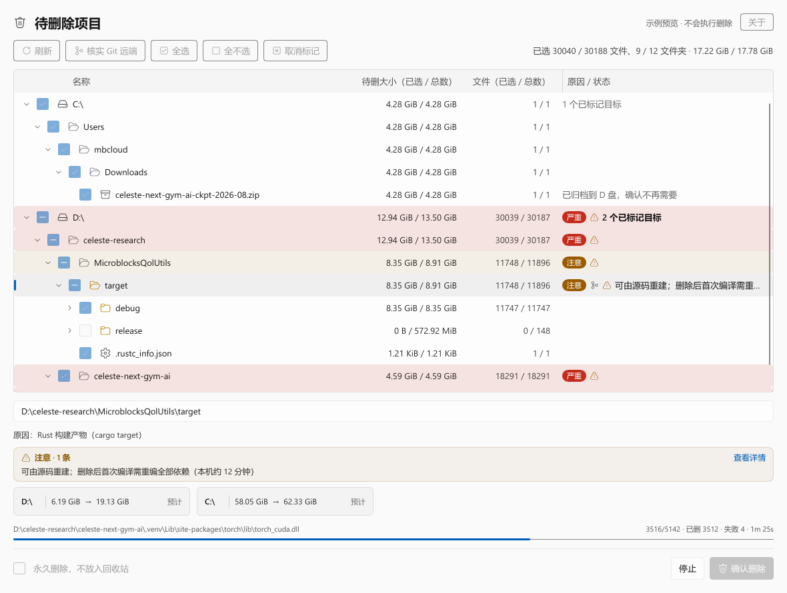
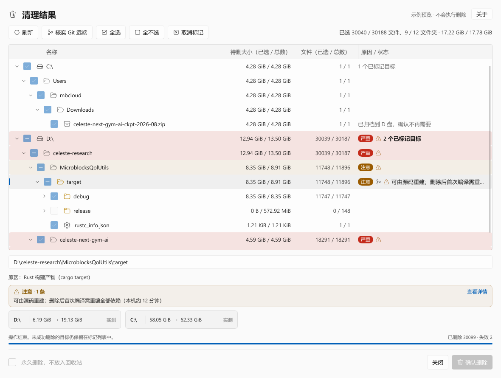
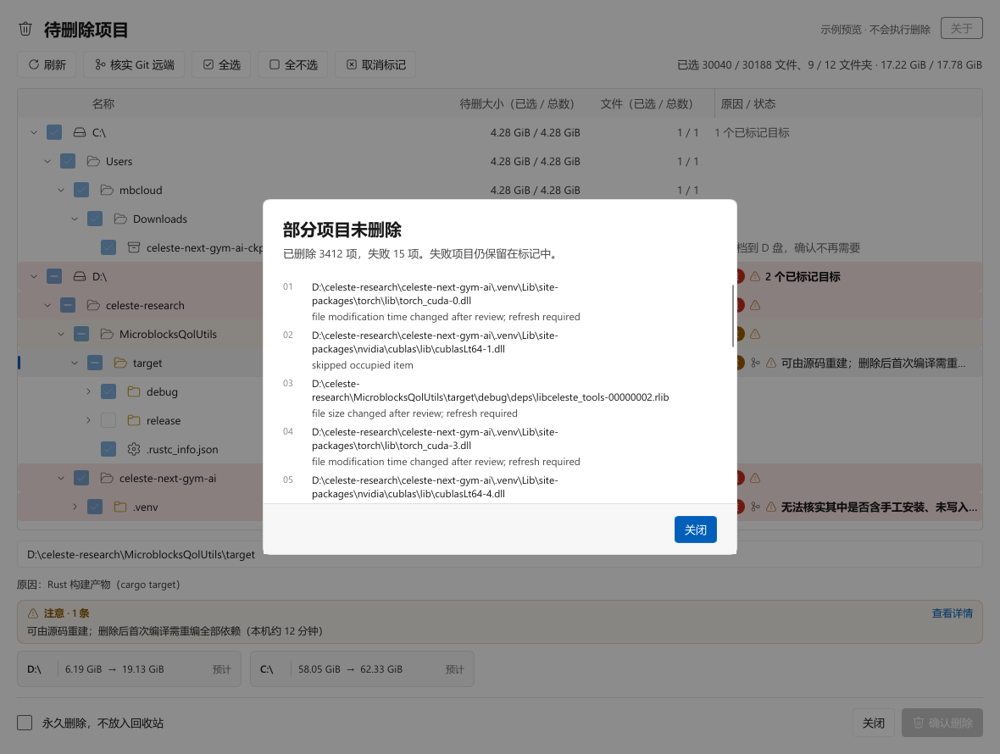
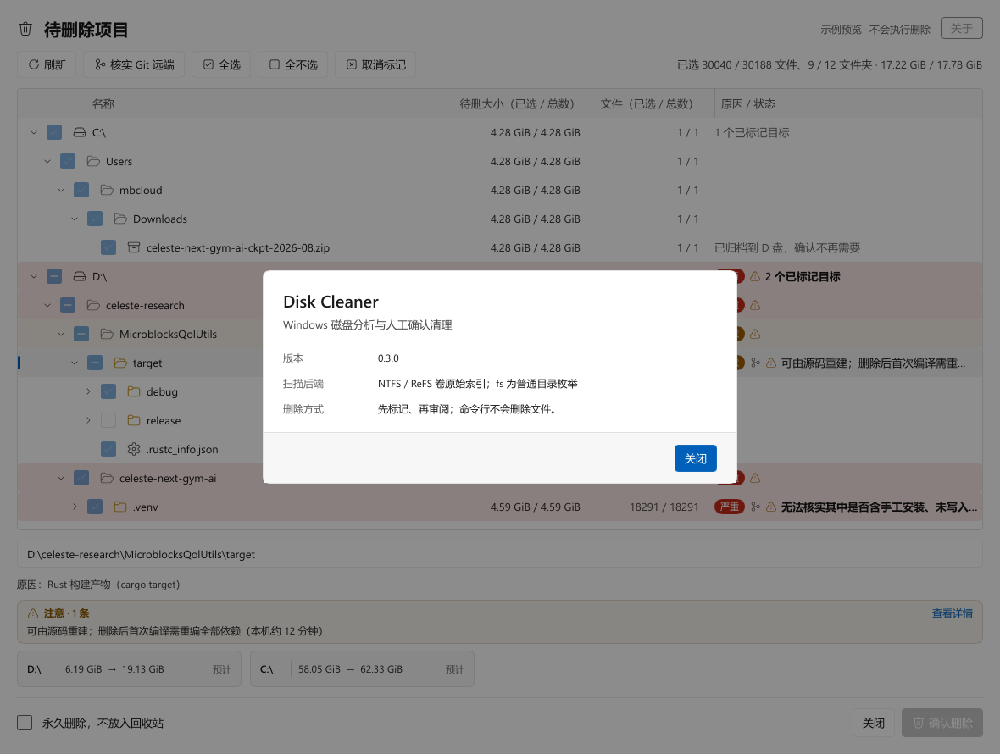

# Windows Disk Cleaner

基于类 Wiztree 的 NTFS/ReFS 快速扫描的 Windows 磁盘清理 Skill：命令行只扫描、只写标记。

**删除是用户手动确定的，比较安全。** 没有无头删除、没有 `--yes`、没有 force-delete，
真正的删除由你在审阅窗口里逐项勾选确认。

## 审阅窗口

<picture>
  <source media="(prefers-color-scheme: dark)" srcset="docs/previews/review-dark.png">
  
</picture>

- 按盘符和真实路径祖先分组：每个目标显示“已选 / 总”大小与文件数；未选中的子项、半选父目录都会保留，
  盘符和中间目录本身不是删除对象。
- 说明列显示标记理由，“注意 / 严重”提示直接挂在行上，选中后可在下方展开全文。
- 底部给出每个卷删除前后的可用空间：删除前是预估，删除结束后换成实测值。

## 删除前的确认

**Git 风险单独确认。** 本地改动、未跟踪与被忽略的文件、stash、未核实的远端都会先列出来，由你决定是否继续。

**文件被占用。** 由 Restart Manager 列出占用进程，是否关闭由你决定；系统进程和服务不会被关闭，只能手动处理或跳过。

**扩大标记范围。** 右击分组行可以把整个目录加入标记，窗口会说明范围变化，并要求重新勾选确认。

## 执行与结果

删除时逐个对象重新打开防替换句柄，核对类型、大小与修改时间；进度、剩余时间和实测释放量都在窗口里。

## 失败与提示

失败项不会被隐藏：原因逐条列出，未成功删除的目标仍保留在标记清单里。

## 安装

    node scripts/install-skill.mjs --release latest --force

## 构建与预览

需要 Windows、Rust stable（1.92+）和 MSVC C++ 构建工具。

    cargo build --release
    node scripts/package-skill.mjs      # dist/windows-disk-cleaner/
    node scripts/archive-skill.mjs      # dist/windows-disk-cleaner-skill.zip + SHA256SUMS.txt

只读 UI 预览（不创建、不删除任何文件，上面的截图就是它生成的）：

    .\target\release\disk-cleaner.exe ui-preview --out docs/previews/review.png --state review
    .\target\release\disk-cleaner.exe ui-preview --out docs/previews/review-dark.png --state review --dark

agent 侧的使用边界见 [skill/windows-disk-cleaner/SKILL.md](skill/windows-disk-cleaner/SKILL.md)，
常用命令见 [references/cli.md](skill/windows-disk-cleaner/references/cli.md)。
